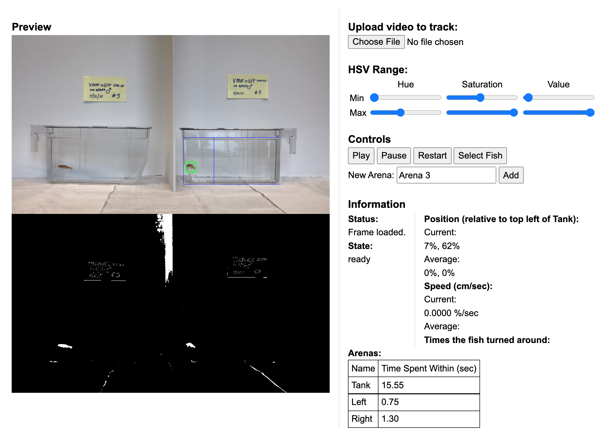

# fish-track: Online Video-Tracking Software

The purpose of this small project was to test the viability of using computer vision online (powered by OpenCV.js) to gain insights as to how fetal alcohol syndrome could influence the swimming patterns of zebrafish. Started during my time at Biola's "Sumer Engineering Internship," (SEI) this software may generalize to other video-tracking tasks. This was abandoned in favor of my main SEI project, found [here](https://github.com/wwwiop/cannulation-project). Possible futures of this project may be a general web-based video tracking service or a mobile video tracking and analytics-related app using [Cordova](https://cordova.apache.org/).

User interface preview:

Copywrite 2021 Daniel Dirksen. All rights Reserved.